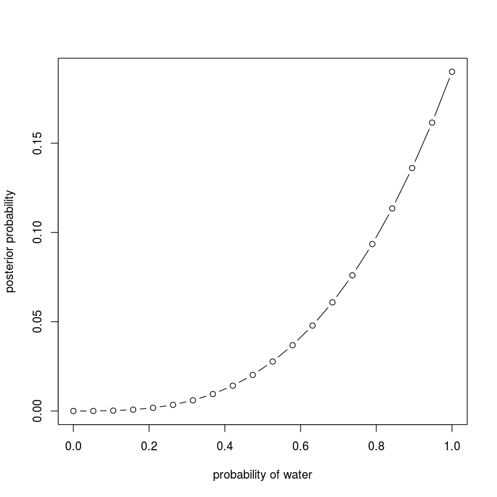
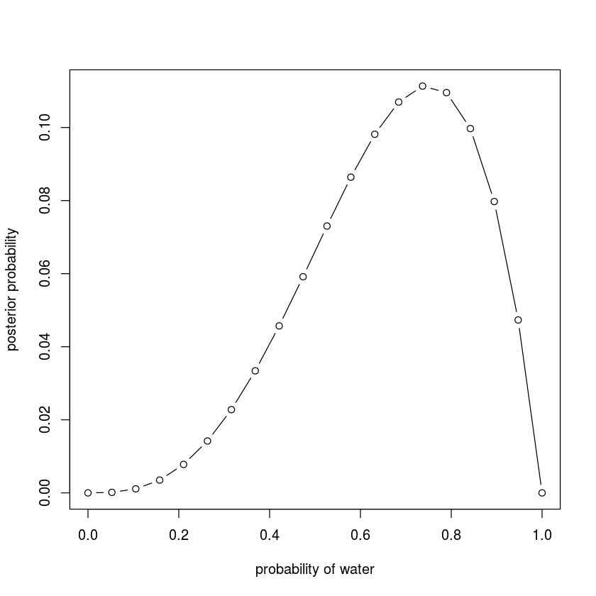
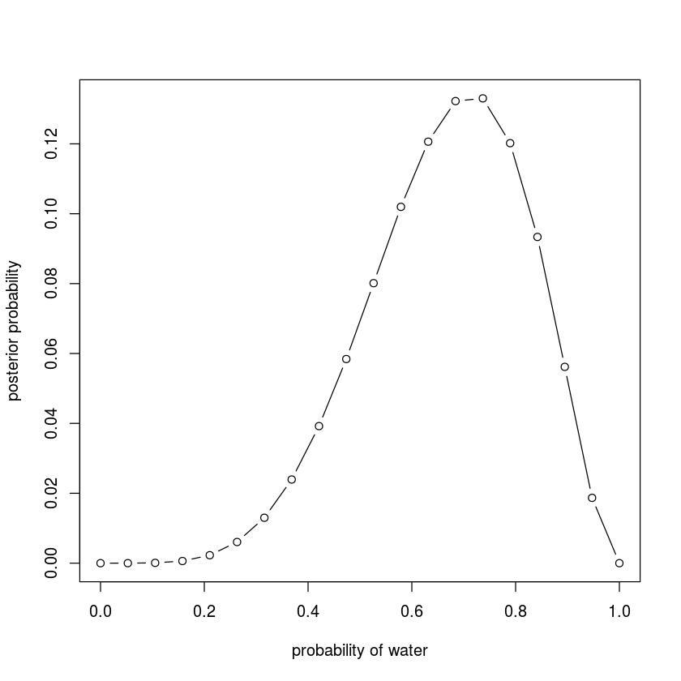

## Function to implement the grid approximate posterior

Refer to the `R code 2.3`, also put the plot into function:


```R
plot_posterior = function (water_count, total) {
  # define grid
  p_grid <- seq(from=0, to=1, length.out=20)
  
  # define prior
  prior <- rep(1, 20)
  
  # compute likelihood at each value in grid
  likelihood <- dbinom(water_count, size=total, prob=p_grid)
  
  # compute product of likelihood and prior
  unstd.posterior <- likelihood * prior
  
  # standaridize the posterior, so it sums to 1
  posterior <- unstd.posterior /sum(unstd.posterior)
  
  plot(p_grid, posterior, type="b",
     xlab="probability of water", ylab="posterior probability")
}
```

## Plot observation sets

1. W, W, W


```R
plot_posterior(water_count=3, total=3)
```





2. W, W, W, L


```R
plot_posterior(water_count=3, total=4)
```





3. L, W, W, L, W, W, W


```R
plot_posterior(water_count=5, total=7)
```




